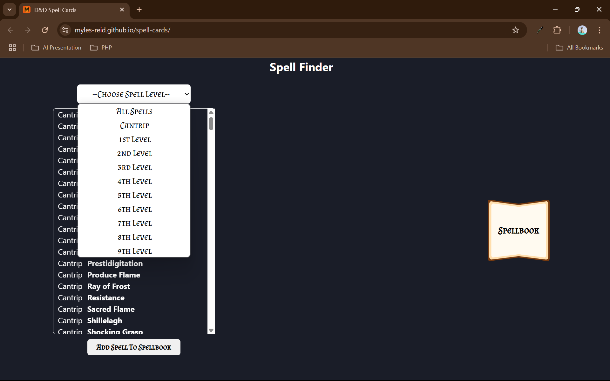
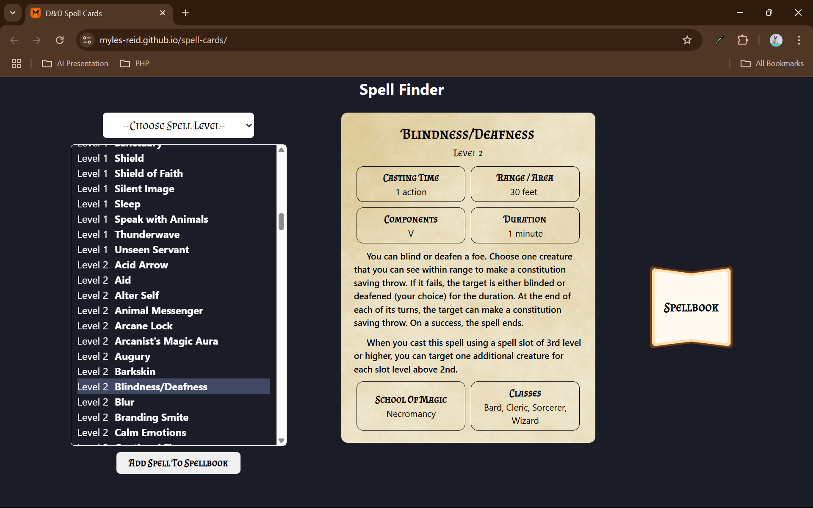
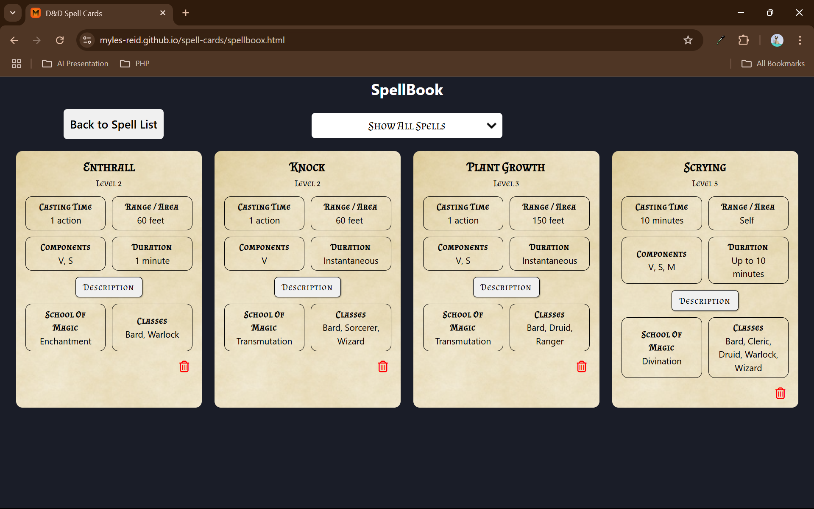

# D&D Spell Cards
Using the D&D 5e API (https://www.dnd5eapi.co/), this project aims to assist players keep their plethoria of spells organized and in one spot.

## Screenshots

## Features

- Sorting Spells by Level
- Local storage
- Spellbook tracking
- Spell Descriptions

## Roadmap

- Search by spell

- Sort by Class

- Search by Spell School

- Add all these search and sort to Spellbook

---
 

  
  
   

